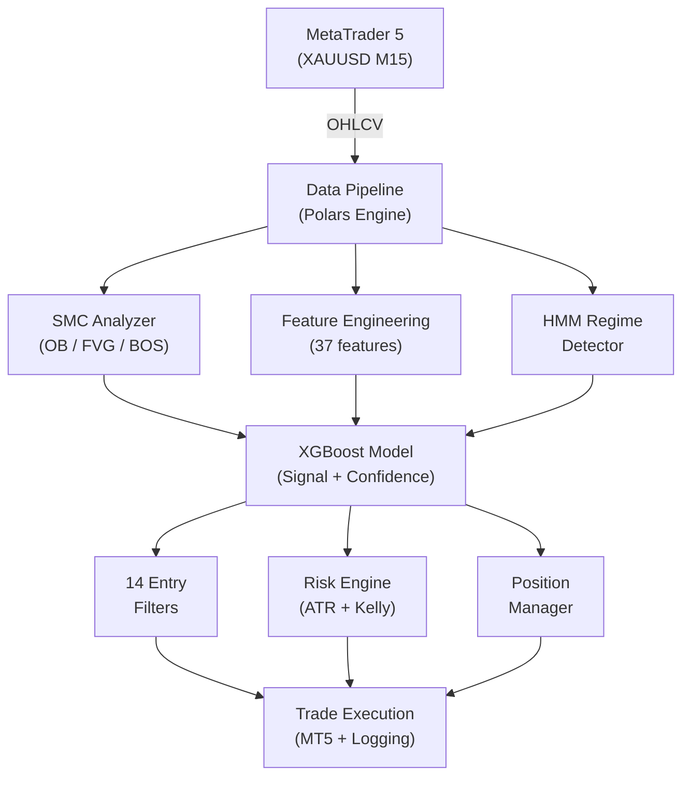

# XAUBot AI

**AI-powered XAUUSD (Gold) trading bot** using *XGBoost ML*, *Smart Money Concepts* (SMC), and *Hidden Markov Model* regime detection for *MetaTrader 5*.

[](https://www.python.org/downloads/)
[](LICENSE)
[](https://www.metatrader5.com/)

---

## Features

| Feature | Description |
|---------|-------------|
| **XGBoost ML Model** | 37-feature model that predicts BUY/SELL/HOLD signals with calibrated confidence |
| **Smart Money Concepts** | Order Blocks, Fair Value Gaps, Break of Structure, Change of Character |
| **HMM Regime Detection** | 3-state Hidden Markov Model that classifies the market as trending/ranging/volatile |
| **Dynamic Risk Management** | ATR-based Stop Loss, Kelly criterion position sizing, daily loss limits |
| **Session Awareness** | Optimized for the Sydney, London, and New York sessions |
| **Automatic Retraining** | Models are retrained automatically when market conditions change |
| **Telegram Notifications** | Real-time trade alerts and daily summaries |
| **Web Dashboard** | Next.js monitoring interface for live tracking |

## Architecture



## Project Structure

```text
xaubot-ai/
|-- main_live.py              # Main async trading orchestrator
|-- train_models.py           # Model training script
|-- src/                      # Core modules
|   |-- config.py             #   Trading configuration & capital modes
|   |-- mt5_connector.py      #   MetaTrader 5 connection layer
|   |-- smc_polars.py         #   Smart Money Concepts analyzer
|   |-- ml_model.py           #   XGBoost trading model
|   |-- feature_eng.py        #   Feature engineering (37 features)
|   |-- regime_detector.py    #   HMM market regime detection
|   |-- risk_engine.py        #   Risk calculation & validation
|   |-- smart_risk_manager.py #   Dynamic risk management
|   |-- session_filter.py     #   Session filter (Sydney/London/NY)
|   |-- position_manager.py   #   Open position management
|   |-- dynamic_confidence.py #   Adaptive confidence thresholds
|   |-- auto_trainer.py       #   Automatic retraining pipeline
|   |-- news_agent.py         #   Economic news filter
|   |-- telegram_notifier.py  #   Telegram notifications
|   |-- trade_logger.py       #   Trade logging to DB
|   `-- utils.py              #   Utility functions
|-- backtests/                # Backtesting
|   |-- backtest_live_sync.py #   Main backtest (synced with live logic)
|   `-- archive/              #   Historical versions
|-- scripts/                  # Utility scripts
|   |-- check_market.py       #   Quick SMC market analysis
|   |-- check_positions.py    #   View open positions
|   |-- check_status.py       #   Check account status
|   |-- close_positions.py    #   Emergency close all positions
|   |-- modify_tp.py          #   Modify take-profit levels
|   `-- get_trade_history.py  #   Pull trade history
|-- tests/                    # Tests
|-- models/                   # Trained models (.pkl)
|-- data/                     # Market data & trade records
|-- docs/                     # Documentation
|   |-- arsitektur-ai/        #   Architecture docs (23 components)
|   `-- research/             #   Research & analysis
|-- web-dashboard/            # Next.js monitoring dashboard
|-- docker/                   # Docker configuration & scripts
|   |-- scripts/              #   Helper scripts (.bat/.sh)
|   `-- docs/                 #   Docker documentation
`-- archive/                  # Deprecated files (gitignored)
```

## Backtest Results (Jan 2025 - Feb 2026)

| Metric | Value |
|--------|-------|
| Total Trades | 654 |
| Win Rate | 63.9% |
| Net P/L | $4,189.52 |
| Profit Factor | 2.64 |
| Max Drawdown | 2.2% |
| Sharpe Ratio | 4.83 |

## Installation

### Docker Deployment (Recommended)

**Quick Start:**

```bash
# 1. Clone the repository
git clone https://github.com/GifariKemal/xaubot-ai.git
cd xaubot-ai

# 2. Configure the environment
cp docker/.env.docker.example .env
# Edit .env with your MT5 credentials

# 3. Start all services (Windows)
docker\scripts\docker-start.bat

# 3. Start all services (Linux/Mac)
./docker/scripts/docker-start.sh
```

**Available services:**
- Dashboard: http://localhost:3000
- API: http://localhost:8000
- API documentation: http://localhost:8000/docs
- Database: localhost:5432

**Complete Docker documentation:** See [docker/docs/DOCKER.md](docker/docs/DOCKER.md)

---

### Manual Installation

**Prerequisites:**
- Python 3.11+
- MetaTrader 5 terminal (Windows)
- PostgreSQL (optional, for trade logging)

**Setup:**

```bash
# Clone the repository
git clone https://github.com/GifariKemal/xaubot-ai.git
cd xaubot-ai

# Install dependencies
pip install -r requirements.txt

# Configure the environment
cp .env.example .env
# Edit .env with your MT5 credentials and Telegram token
```

### Configuration

Main settings in `.env`:

```env
# MetaTrader 5
MT5_LOGIN=your_login
MT5_PASSWORD=your_password
MT5_SERVER=your_server
MT5_PATH=C:/Program Files/MetaTrader 5/terminal64.exe

# Telegram notifications
TELEGRAM_BOT_TOKEN=your_bot_token
TELEGRAM_CHAT_ID=your_chat_id

# Trading
CAPITAL=5000
SYMBOL=XAUUSD
```

### Running

```bash
# Train the model first
python train_models.py

# Run the bot
python main_live.py

# Run a backtest
python backtests/backtest_live_sync.py --tune
```

## Risk Management

| Protection | Details |
|------------|---------|
| **ATR-Based Stop Loss** | Minimum distance of 1.5x ATR |
| **Broker-Level Stop Loss** | Emergency Stop Loss is set at broker level |
| **Position Sizing** | Kelly criterion with capital mode adjustment |
| **Daily Loss Limit** | 5% of capital per day |
| **Total Loss Limit** | 10% of capital |
| **Position Limit** | Maximum 2 simultaneous positions |
| **Time-Based Exit** | Maximum 6 hours per trade |
| **Session Filter** | Only opens trades during active sessions |
| **Spread Filter** | Rejects trades when spread is high |
| **Cooldown** | Minimum time between trades |

## Technology

- **Polars** - High-performance data processing engine (not Pandas)
- **XGBoost** - Gradient boosting machine learning model
- **hmmlearn** - Hidden Markov Model for market regime detection
- **MetaTrader5** - Broker connection API
- **asyncio** - Asynchronous event loop for low-latency execution
- **loguru** - Structured logging
- **PostgreSQL** - Trade logging database
- **Next.js** - Web dashboard

## Warning

> This software is built **for educational and research purposes only**. Trading foreign exchange (Forex) and commodities on margin carries a high level of risk and may not be suitable for all investors. Past performance is not indicative of future results. You may lose some or all of your investment. **Use at your own risk.**

## License

[MIT License](LICENSE) - Copyright (c) 2025-2026 Gifari Kemal
